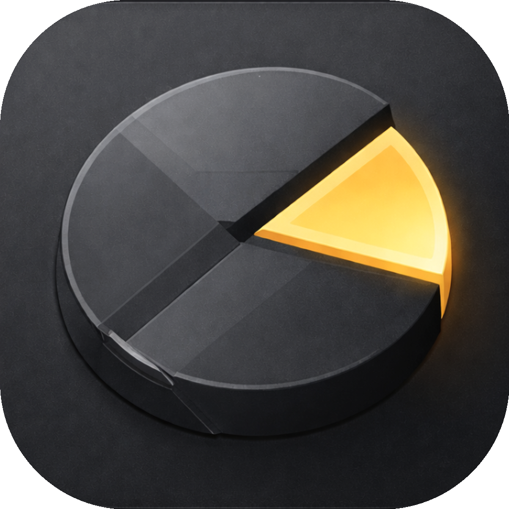

<div align="center">
  

  # 龙虾孵化器 🥚

  <p align="center">
    
    
    
    
  </p>

  OpenClaw 一键安装器 - 让 AI Agent 部署像煮鸡蛋一样简单

  [快速开始](#快速开始) • [开发计划](#开发计划)
</div>

---

## 功能预览

龙虾孵化器是一个跨平台的 OpenClaw 安装工具，帮助用户快速部署和配置 OpenClaw AI Agent 平台。

<div align="center">

| 安装向导 | 环境检测 |
|:---:|:---:|
|  |  |

| 配置管理 | 一键启动 |
|:---:|:---:|
|  |  |

</div>

---

## 核心特性

- 🚀 **一键安装**：自动检测并安装 Node.js、CMake、OpenClaw 等依赖
- 🔍 **环境检测**：智能检测系统环境，自动修复常见问题
- 🎨 **友好界面**：现代化的 UI 设计，支持暗黑模式
- 🖥️ **跨平台**：支持 Windows 和 macOS
- 🔐 **安全配置**：图形化配置飞书机器人、OAuth 认证等

---

## 快速开始

### 🛠️ 环境准备

确保你的开发环境已安装以下工具：

* **Rust**: `rustc 1.86+`
* **Node.js**: `v20+`
* **包管理器**: `npm` 或 `pnpm`

### 🖥️ 开发调试

```bash
# 1. 克隆项目
git clone https://github.com/LSTM-Kirigaya/claw-egg.git
cd claw-egg/apps/desktop

# 2. 安装前端依赖
cd frontend && npm install && cd ..

# 3. 启动开发模式 (自动开启 Rust 后端与 React 前端)
npm run dev
```

### 构建发布

```bash
cd apps/desktop
npx tauri build --target x86_64-pc-windows-msvc
```

---

## 开发计划

- [x] 基础项目架构
- [x] 跨平台支持 (Windows/macOS)
- [ ] Node.js 自动安装
- [ ] CMake 自动安装
- [ ] OpenClaw 自动安装与配置
- [ ] 飞书机器人配置向导
- [ ] 环境检测与修复

---

## 许可证

本项目采用 [Apache License 2.0](LICENSE) 许可证。

Copyright © 2026 **龙虾孵化器 Contributors**.
